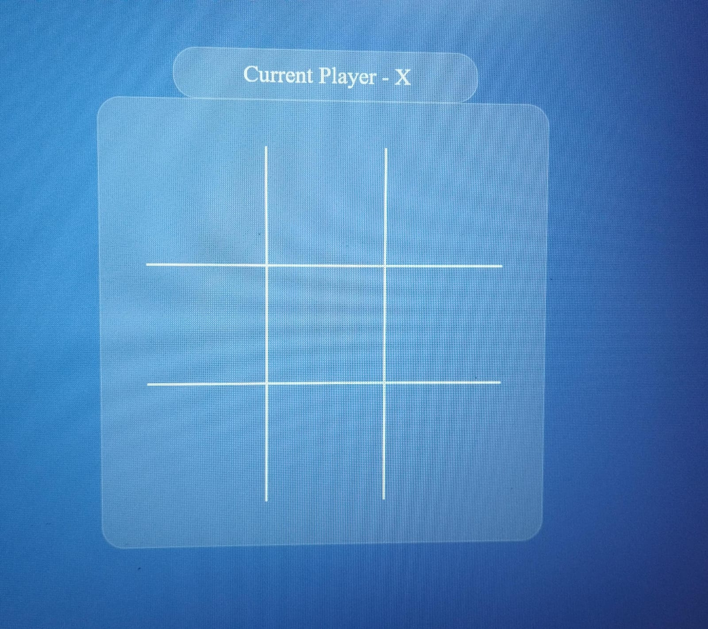
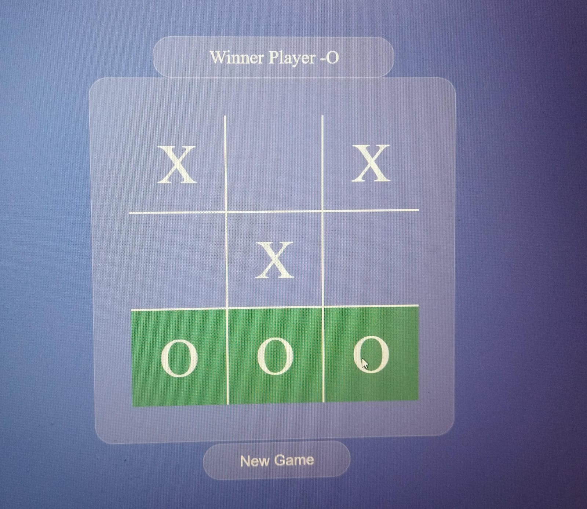
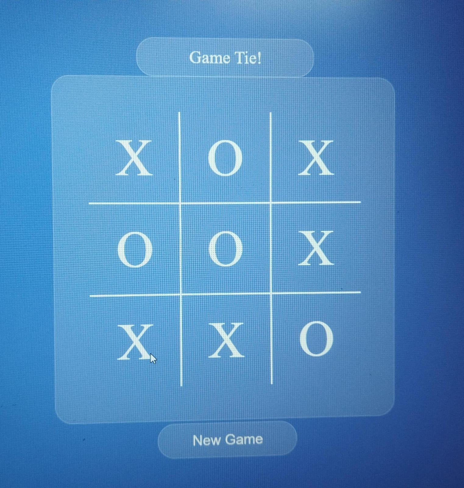

# 🎮 Tic Tac Toe Game

A simple and interactive Tic Tac Toe game built using HTML, CSS, and JavaScript.

## 🚀 Features

* Two-player gameplay (X vs O)
* Turn-based logic
* Win detection
* Draw (tie) detection
* Sound effects (click, win, tie)
* New Game reset button
* Responsive UI

## 🛠️ Tech Stack

* HTML
* CSS
* JavaScript

## 📸 Screenshots

  
  
  

## 🎯 How to Play

1. Player X starts the game
2. Players take turns clicking on empty boxes
3. First player to align 3 marks (row, column, diagonal) wins
4. If all boxes are filled, the game is a draw

## 📂 Project Structure

* index.html
* styles.css
* index.js
* sound files (click.mp3, win.mp3, tie.mp3)

## 🌐 Live Demo

 https://adityakumar88813-glitch.github.io/tic-tac-toe-js/

## 📌 Future Improvements

* Add computer (AI) opponent
* Add difficulty levels
* Improve UI animations
* Add score tracking

## 🙌 Author

Aditya Kumar

